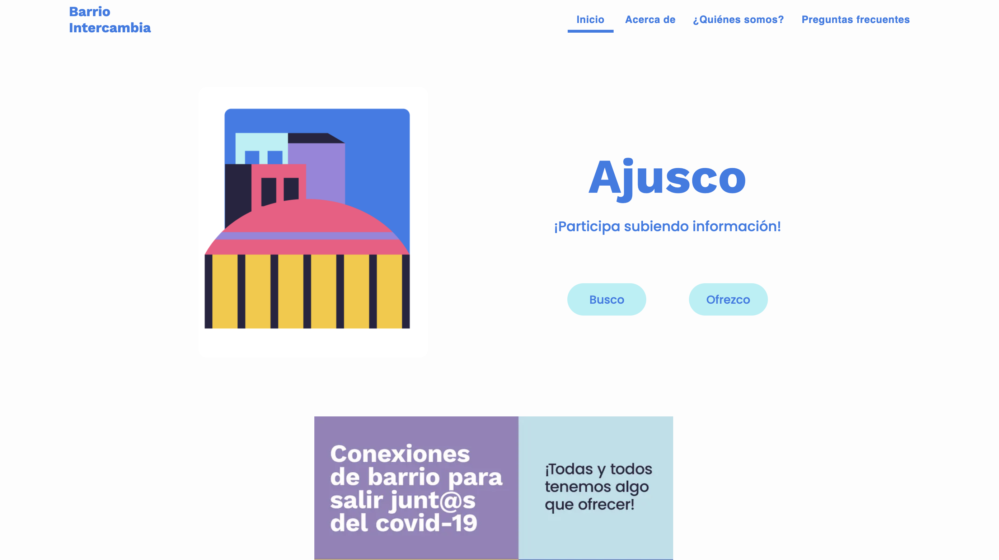
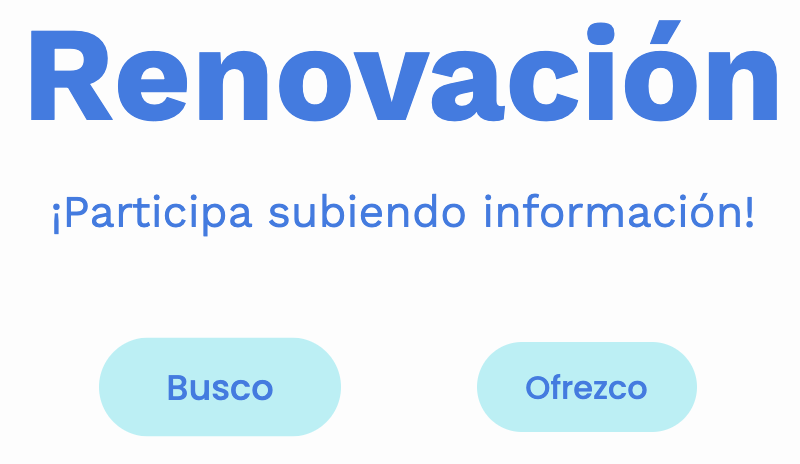
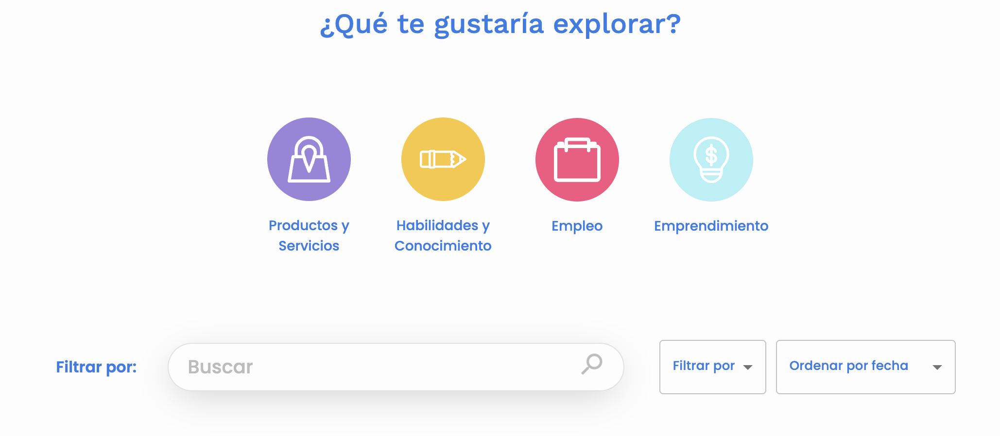

## Desarrollo y Implementación de la Plataforma Tecnológica 'Barrio Intercambia' para el Proyecto Ciudad Policéntrica - PNUD CDMX (2020)
Esta herramienta digital forma parte del catálogo de herramientas del Banco Interamericano de Desarrollo. Puedes conocer más sobre la iniciativa del BID en [code.iadb.org](http://code.iadb.org)

<h1 align="center"> Micrositio índice de capital social</h1>

 

## Tabla de Contenidos
- [Badges o Escudos](#badges-o-escudos)
- [Descripción y Contexto](#descripción-y-contexto)
- [Guía de Usuario](#guía-de-usuario)
- [Guía de Instalación](#guía-de-instalación)
- [Cómo Contribuir](#cómo-contribuir)
- [Código de Conducta](#código-de-conducta)
- [Autor/es](#autores)
- [Información Adicional](#información-adicional)
- [Licencia](#licencia)
- [Limitación de Responsabilidades (Solo BID)](#limitación-de-responsabilidades-solo-bid)

## Descripción y Contexto
Este repositorio contiene el código fuente de una plataforma en línea la cual permite a los residentes de comunidades en Ciudad Policéntrica publicar y buscar necesidades u ofrecer servicios, productos, habilidades, o cualquier tipo de ayuda que puedan proporcionar o necesitar dentro de su comunidad.

## Guía de Usuario
Esta herramienta esta separada para funcionar en dos colonias. Renovación y Topiltzin separadas en subrutas del mismo dominio. En la herramienta el usuario dispone de dos posibilidades; ser buscador o ofrecer un trabajo. Para cualquiera de estas dos opciones tienes que indentificarte dar datos de contacto y seleccionar cuanto tiempo quieres que el anuncio este colgado. 
|  |  |
|:---:|:---:|
| Caption 1 | Caption 2 |

## Guía de Instalación
Proporciona instrucciones detalladas sobre cómo instalar la herramienta digital, incluyendo requisitos del sistema operativo, dependencias, y pasos para la compilación y ejecución.

## Cómo Contribuir
Indica cómo los desarrolladores pueden contribuir al proyecto mediante pull requests, reporte de errores, etc. También puedes describir las pautas de estilo que se deben seguir.

## Código de Conducta
Lee y adhiérete al código de conducta del proyecto para garantizar un entorno de colaboración respetuoso y acogedor. Puedes encontrar más detalles en el archivo CODE_OF_CONDUCT.md.

## Autor/es
Este micrositio fue desarrollado por: Servicios de apoyo de diseño y programación de soluciones tecnológicas, ciencia de datos y análisis y visualización de datos para el Laboratorio de Aceleración del PNUD en México (AccLab)

## Información Adicional
Visita [la web de acclab](https://www.undp.org/acceleratorlabs) para obtener más información sobre el Laboratorio de Aceleración PNUD México y sus proyectos.

## Licencia
Este proyecto está bajo la siguiente licencia: [Nombre de la Licencia]. Ver el archivo LICENSE.md para más detalles.

## Limitación de Responsabilidades (Solo BID)
Disclaimer
El BID no será responsable, bajo ninguna circunstancia, por daños o pérdidas derivadas del uso de esta herramienta digital, incluyendo defectos en la herramienta o pérdida/inexactitud de datos.