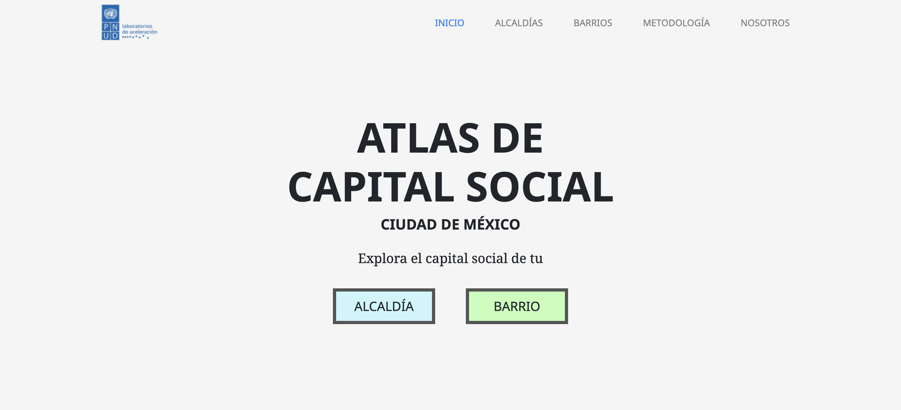

## Micrositio Índice de Capital Social - PNUD CDMX (2020)
Esta herramienta digital forma parte del catálogo de herramientas del Banco Interamericano de Desarrollo. Puedes conocer más sobre la iniciativa del BID en [code.iadb.org](http://code.iadb.org)

<h1 align="center"> Micrositio índice de capital social</h1>

 Logo e imagen o gif de la interfaz principal de la herramienta

 

## Tabla de Contenidos
- [Descripción y Contexto](#descripción-y-contexto)
- [Guía de Usuario](#guía-de-usuario)
- [Guía de Instalación](#guía-de-instalación)
- [Autor/es](#autores)
- [Información Adicional](#información-adicional)
- [Licencia](#licencia)
- [Limitación de Responsabilidades (Solo BID)](#limitación-de-responsabilidades-solo-bid)

## Descripción y Contexto
Este repositorio contiene el código fuente del micrositio desarrollado para enseñar el Índice de Capital Social del PNUD en la Ciudad de México en 2020. El principal objetivo del micrositio es dar a conocer y demostrar de manera transparente la metodología utilizada en el proyecto.

## Guía de Usuario

Contando con la página de inicio podemos encontrar 5 subrutas en el dominio web.
|  |
|:---:|
| Inicio |

|  |  |
|:---:|:---:|
| Aquí el usuario puede filtrar el capital social por alcaldía. | El usuario puede filtrar el capital social por barrio. |

|  |  |
|:---:|:---:|
| La metodología y datos usados se encuentran en esta página. | Página de nosotros |

## Guía de Instalación
    #install dependencies
    $ npm install

    #serve with hot reload at localhost:3000
    $ npm run dev

    #build for production and launch server
    $ npm run build
    $ npm run start

    #generate static project
    $ npm run generate

## Autor/es
Este micrositio fue desarrollado por: Servicios de apoyo de diseño y programación de soluciones tecnológicas, ciencia de datos y análisis y visualización de datos para el Laboratorio de Aceleración del PNUD en México (AccLab)

## Información Adicional
Visita [la web de acclab](https://www.undp.org/acceleratorlabs) para obtener más información sobre el Laboratorio de Aceleración PNUD México y sus proyectos.

## Licencia
Este proyecto está bajo la siguiente licencia: [Nombre de la Licencia]. Ver el archivo LICENSE.md para más detalles.

## Limitación de Responsabilidades (Solo BID)
Disclaimer: Esta sección es solo para herramientas financiadas por el BID.

El BID no será responsable, bajo circunstancia alguna, de daño ni indemnización, moral o patrimonial; directo o indirecto; accesorio o especial; o por vía de consecuencia, previsto o imprevisto, que pudiese surgir:

i. Bajo cualquier teoría de responsabilidad, ya sea por contrato, infracción de derechos de propiedad intelectual, negligencia o bajo cualquier otra teoría; y/o

ii. A raíz del uso de la Herramienta Digital, incluyendo, pero sin limitación de potenciales defectos en la Herramienta Digital, o la pérdida o inexactitud de los datos de cualquier tipo. Lo anterior incluye los gastos o daños asociados a fallas de comunicación y/o fallas de funcionamiento de computadoras, vinculados con la utilización de la Herramienta Digital.